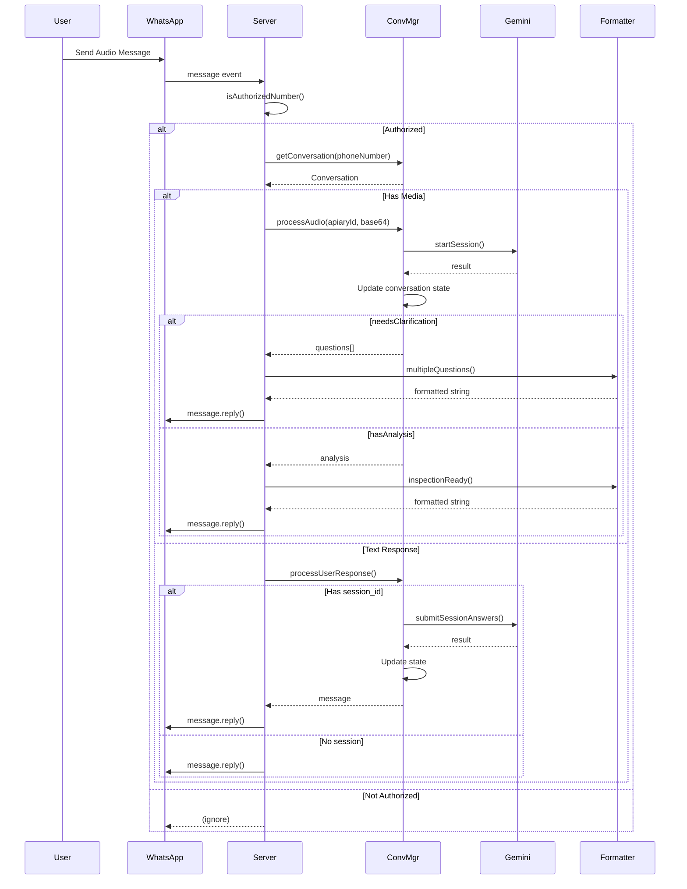
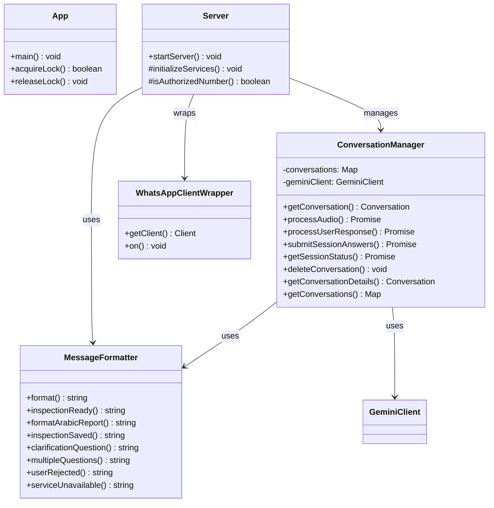
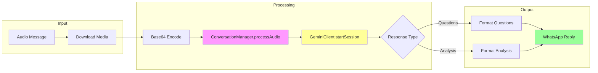

# Function Relationships - WhatsApp Web.js Service

## Flowchart: Application Startup and Message Processing

```mermaid
flowchart TB
    subgraph app["app.ts"]
        main["main()"] --> acquireLock["acquireLock()"]
        main --> releaseLock["releaseLock()"]
    end

    subgraph server["api/server.ts"]
        startServer["startServer()"] --> initServices["initializeServices()"]
        initServices --> createWhatsApp["new WhatsAppClientWrapper()"]
        initServices --> createConvMgr["new ConversationManager()"]
        
        initServices --> setupQR["QR Event Handler"]
        initServices --> setupReady["Ready Event Handler"]
        initServices --> setupMsg["Message Event Handler"]
        initServices --> setupDisconnect["Disconnected Event Handler"]
        initServices --> setupError["Error Event Handler"]
        
        setupMsg --> isAuthorized["isAuthorizedNumber()"]
        setupMsg --> getConv["getConversation()"]
        
        setupMsg --> hasMedia{hasMedia?}
        hasMedia -->|Yes| downloadMedia["message.downloadMedia()"]
        downloadMedia --> processAudio["processAudio()"]
        
        hasMedia -->|No| processResponse["processUserResponse()"]
        
        processAudio --> use["MessageFormatter"]
        processResponse --> use
    end

    subgraph manager["services/conversation/manager.ts"]
        getConvMgr["getConversation()"] --> createGemini["new GeminiClient()"]
        
        processAudioMgr["processAudio()"] --> startSession["geminiClient.startSession()"]
        processAudioMgr --> updateConv["Update Conversation State"]
        
        processResponseMgr["processUserResponse()"] --> hasSession{session_id?}
        hasSession -->|Yes| submitAnswers["submitSessionAnswers()"]
        hasSession -->|No| checkConfirm["Check Confirmation/Rejection"]
        
        submitAnswers --> submitToGemini["geminiClient.submitSessionAnswers()"]
        submitAnswers --> updateConv2["Update Conversation State"]
        
        checkConfirm --> formatMsg["MessageFormatter.inspectionReady()"]
        checkConfirm --> formatMsg2["MessageFormatter.userRejected()"]
        checkConfirm --> formatMsg3["MessageFormatter.serviceUnavailable()"]
    end

    subgraph formatter["utils/message-formatter.ts"]
        format["format()"]
        inspectionReady["inspectionReady()"]
        formatArabic["formatArabicReport()"]
        inspectionSaved["inspectionSaved()"]
        clarification["clarificationQuestion()"]
        multipleQuestions["multipleQuestions()"]
        userRejected["userRejected()"]
        serviceUnavailable["serviceUnavailable()"]
        
        inspectionReady --> formatArabic
    end

    %% Relationships
    processAudio -->|Returns| use
    processResponse -->|Returns| use
    startSession -->|Returns| processAudioMgr
    submitToGemini -->|Returns| submitAnswers
    submitAnswers -->|Returns| formatMsg
```

## Sequence Diagram: Message Processing Flow

## Class Diagram: Key Components

## Data Flow: Audio to Analysis

